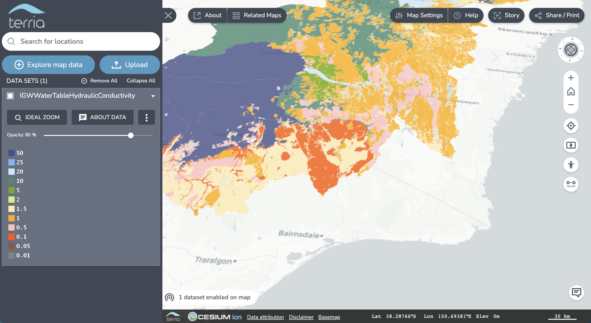

TerriaJS
============

 

TerriaJS is a library for building rich, web-based geospatial data explorers, used to drive [National Map](http://nationalmap.gov.au), [AREMI](http://nationalmap.gov.au/renewables) and [NEII Viewer](http://neii.gov.au/viewer/).  It uses [Cesium](https://cesiumjs.org) and WebGL for a full 3D globe in the browser with no plugins.  It gracefully falls back to 2D with [Leaflet](http://leafletjs.com/) on systems that can't run Cesium. It can handle catalogs of thousands of layers, with dozens of geospatial file and web service types supported. It is almost entirely JavaScript in the browser, meaning it can even be deployed as a static website, making it simple and cheap to host.

--------------------

**We have just released a brand new version of Terria &mdash; verson 8!**

We've put together a list of things we've removed from version 8 and some steps to help you migrate to the new version in our [migration guide](https://docs.terria.io/guide/contributing/migration-guide/)

**Not ready to move to version 8 yet? You can find terriajs version 7 here:** https://github.com/TerriaJS/terriajs/tree/terriajs7

--------------------

### Features

* Nested catalog of layers which can be independently enabled to create mashups of many layers.
* Supports GeoJSON, KML, CSV (point and region-mapped), GPX and CZML file types natively, and others including zipped shapefiles with an optional server-side conversion service.
* Supports WMS, WFS, Esri MapServer, ABS ITT, Bing Maps, OpenStreetMap-style raster tiles, Mapbox, Urthecast, and WMTS item types.
* Supports querying WMS, WFS, Esri MapServer, CSW, CKAN and Socrata services for groups of items.
* 3D globe (Cesium) or 2D mode (Leaflet). 3D objects supported in CZML format.
* Time dimensions supported for CSV, CZML, WMS. Automatically animate layers, or slide the time control forward and backward.
* Drag-and-drop files from your desktop to the browser, for instant visualisation (no file upload to server required).
* Wider range of file types supported through server-side OGR2OGR service (requires upload).
* All ASGS (Australian Statistical Geographic Standard) region types (LGA, SA2, commonwealth electoral district etc) supported for [CSV region mapping](https://github.com/TerriaJS/nationalmap/wiki/csv-geo-au), plus several others: Primary Health Networks, Statistical Local Areas, ISO 3 letter country codes, etc.
* Users can generate a reusable URL link of their current map view, to quickly share mashups of web-hosted data.

### Who's using TerriaJS?

#### Sites developed by Data61

* [National Map](http://nationalmap.gov.au)
* [AREMI](http://nationalmap.gov.au/renewables)
* [Northern Australia Investment Map](http://nationalmap.gov.au/northernaustralia)
* [NEII Viewer](http://neii.org.au/viewer)
* [Global Risk Map](http://globalriskmap.nicta.com.au)
* [Ground Water Visualisation System](https://groundwater.data61.csiro.au)
* [State of the Environment 2016](https://soe.terria.io/)
* [ParlMap](http://parlmap.terria.io/) (authorisation required)
* [GeoGLAM Rangeland and Pasture Productivity](http://map.geo-rapp.org/)
* [City of Sydney data explorer](http://data.cityofsydney.nsw.gov.au/map)

#### Not Data61

Sites we're aware of that are using TerriaJS. These are not endorsements or testimonials.

* [AURIN Map](http://map.aurin.org.au/)
* [Leylines](http://maps.leylines.ch/)
* [PropellerAero](http://www.propelleraero.com/)
* [USGS Protected Areas database](https://maps.usgs.gov/beta/padus/) (beta)
* [Map-N-Tour](http://mapntour.squarespace.com/news/?tag=3D+Map+Platforms)
* [Innovisite France Beta](http://www.innovisite.com/map/france/)
* [USGS The National Map Advanced Viewer](https://viewer.nationalmap.gov/advanced/terriajs-usgs/)
* [Portale del suolo](http://www.sardegnaportalesuolo.it/webgis/)
* [Find & Connect Map of Children's Homes](https://map.findandconnect.gov.au/)

### Technical

* **Note: Please use NodeJS v10 until [#4617](https://github.com/TerriaJS/terriajs/issues/4617) is resolved**
* Built in ECMAScript 2015, compiled with Babel to ES5.
* Supports IE9 and later. A few features require IE11+.
* [TerriaJS Server component](https://github.com/TerriajS/TerriaJS-Server) runs in NodeJS and provides proxying for web services that don't support CORS or require authentication. Instead of using TerriaJS-Sever proxy service, an alternative proxying service URL can be specified. See [Specify an alternative proxy server URL](/doc/connecting-to-data/cross-origin-resource-sharing.md)
* Dependencies are [managed in NPM](https://www.npmjs.com/~terria) and assembled using WebPack.

### Getting Started ###

The easiest way to build your own Terria-based map is using the TerriaMap starting point. This gives you the HTML structure, server and build processes you need to get a site up and running immediately.

See [Getting Started](http://terria.io/Documentation/guide/getting-started/) in the [Documentation](http://terria.io/Documentation/guide/) for all the details.

### Components and naming

* **[Terria™](http://terria.io)** is the overall name for the spatial data platform and the team that built TerriaJS.
* **TerriaJS** is this JavaScript library consisting of the 2D/3D map, catalog management and many spatial data connectors.
* **[Cesium](https://github.com/TerriaJS/Cesium)** is the 3D WebGL rendering library used by TerriaJS, which provides many low-level functions for loading and displaying imagery and spatial formats such as GeoJSON and KML.
* **[TerriaMap](https://github.com/TerriaJS/TerriaMap)** is a complete website starting point, using TerriaJS.
* **[TerriaJS-Server](https://github.com/TerriaJS/TerriaJS-Server)** is a NodeJS-based server that provides proxying and support services for TerriaJS.
* **[NationalMap](https://github.com/NICTA/NationalMap)** is the flagship Terria deployment, and the origin of the TerriaJS library.

#### Related components

* **[Catalog Editor](https://github.com/TerriaJS/catalog-editor)**, an automatically generated web interface for creating and editing catalog (init) files.
* **[Generate-TerriaJS-Schema](https://github.com/TerriaJS/generate-terriajs-schema)**, a tool which automatically generates a schema for validating catalog files, and also the editor, by processing TerriaJS source code.
* **[TerriaMapStatic](https://github.com/terriajs/terriamapstatic)**, a pre-built version of TerriaMap, which can be deployed as a static HTML website, such as on Github Pages.

### Big Thanks

Cross-browser Testing Platform and Open Source <3 Provided by [Sauce Labs](https://saucelabs.com)

### Join the community

Get in touch!

* Chat in our [Gitter chat room](https://gitter.im/TerriaJS/terriajs)
* Join the [TerriaJS Google Group](https://groups.google.com/forum/#!forum/terriajs)
* Raise issues in the [Github issue tracker](https://github.com/TerriaJS/terriajs/issues/new)
